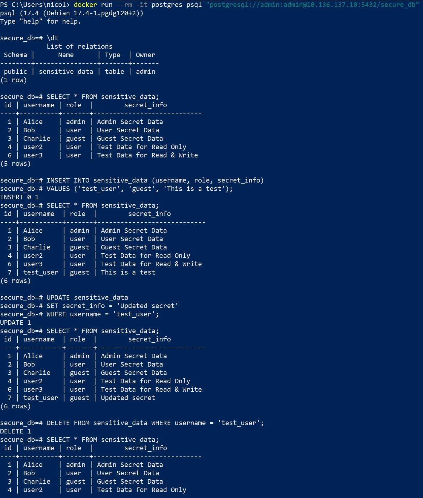
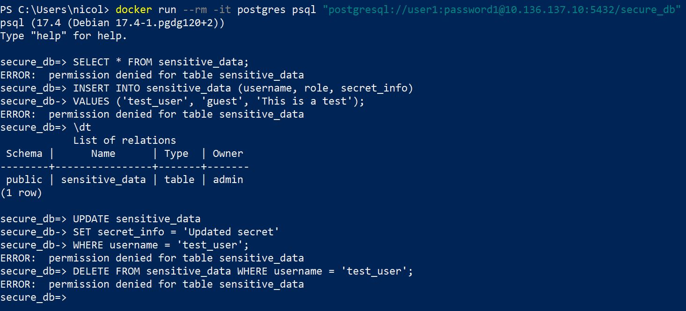
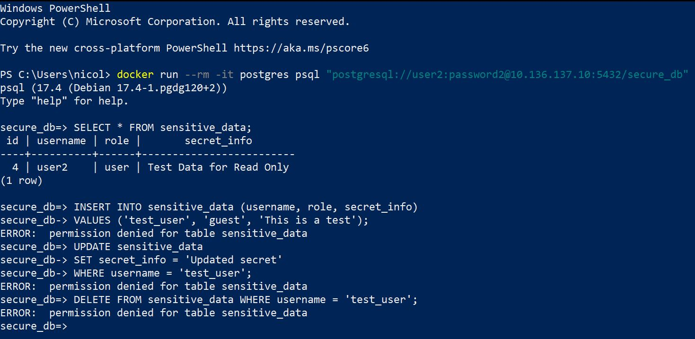

# Mine opdagelser som Integrator
I de underliggende screenshots vil jeg vise mine opdagelser som integrator til en PostgreSQL-database, hvor jeg har undersøgt graden af granulær adgangskontrol for de forskellige brugere.
## Adgang som Admin
Admin-brugeren har fuld adgang til tabellen sensitive_data, hvilket inkluderer: SELECT (læse data), INSERT (indsætte data), UPDATE (opdatere data) og DELETE (slette data)

## Adgang som User 1
User 1 får permission denied fejl på alle operationer.

## Adgang som User 2
User 2 kan kun læse egen række med SELECT. INSERT, UPDATE og DELETE resulterer i permission denied fejl

## Adgang som User 3 Access
User 3 kan også kun læse egen række med SELECT...
